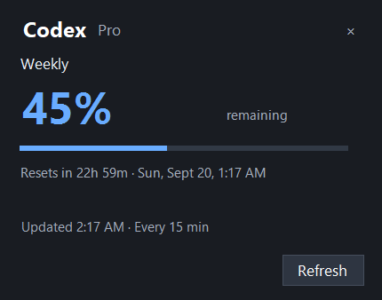
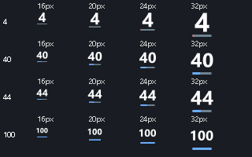

# Codex Meter

**Your Codex limits, beside the Windows clock.**

A minimal native Windows 11 tray app. The icon shows your lowest percentage remaining; click it for all reported limits and reset times. Refreshes every **15 minutes**, with **no model calls or token consumption for polling**.

[**Download for Windows**](https://github.com/Bangerz/CodexMeter/releases/latest) · [CC0 license](LICENSE)



*Illustrative sample data, not a live account.*

## Install

1. Download the Windows x64 ZIP from [Releases](https://github.com/Bangerz/CodexMeter/releases/latest).
2. Install the **[.NET 10 Desktop Runtime, Windows x64](https://dotnet.microsoft.com/en-us/download/dotnet/10.0)** if needed. Choose Desktop Runtime, not just the base .NET Runtime.
3. Extract the ZIP to a permanent folder and run `CodexMeter.exe`.
4. Have the **Codex desktop app or native Codex CLI** installed and signed in with your ChatGPT account.

The small **framework-dependent** download does not bundle .NET. No administrator privileges, installer, service, or browser is required. The executable is unsigned; Windows may show an unrecognized-app warning.

Windows may initially put the icon under the tray's **^** overflow. Drag it beside the clock to keep it visible.

## Use

- **Tray number:** lowest percentage remaining across reported windows.
- **Left-click:** all percentages, reset countdowns, local reset dates, and the last successful update time.
- **Right-click:** Show limits, Refresh now, Start with Windows, or Quit.
- **Refresh:** at launch, every 15 minutes, and after resuming Windows when an update is due.
- **Amber `!`:** a check failed or data is stale. Retained figures are marked as last known.
- **Start with Windows:** optional, off by default. Enable after choosing a permanent folder; disable before moving or deleting the app.

Supports weekly-only accounts, five-hour plus weekly windows, and multiple usage buckets. Missing values stay unavailable. Passing a reset time does not manufacture replenished quota.



## No tokens used for polling

Each poll starts a hidden `codex app-server --listen stdio://`, sends only:

1. `initialize`
2. `initialized`
3. `account/rateLimits/read`

Then it closes its private helper. No thread or model turn is started. It never redeems resets, purchases credits, or calls an inference API.

Codex manages its existing authentication and any required token refresh. Codex Meter does not itself read, copy, or save OAuth credentials, account identifiers, raw server logs, or usage history. The optional startup setting is stored in the current user's Windows Run registry key.

See the [official Codex App Server protocol](https://learn.chatgpt.com/docs/app-server#6-rate-limits-chatgpt). The app-server command is experimental; future Codex changes may require an update.

## Troubleshooting

**No usage:** Open Codex, confirm ChatGPT sign-in, then click Refresh. API-key-only accounts do not supply ChatGPT plan limits.

**Executable not found:** The app checks the running Codex process, the desktop app's versioned binary directory, and native CLI installations on PATH. Set `CODEX_METER_CODEX_PATH` to the full path of your `codex.exe` to override discovery.

**Different account:** The helper inherits `CODEX_HOME` if set. Limits belong to the signed-in account, not a single task.

**Uninstall:** Disable Start with Windows, choose Quit, and delete its folder.

## Build

Requires Windows and the .NET 10 SDK. No third-party library packages are used.

```powershell
.\build.ps1
dotnet run --project .\tests\CodexMeter.Tests.csproj -c Release
```

The executable is written to `artifacts/publish/CodexMeter.exe`. Build caches and temporary files stay in the repository.

Build, check, and package a release:

```powershell
.\release.ps1
```

Produces a Windows x64 ZIP and SHA-256 checksums under `artifacts/releases/`. Focused checks cover parsing, missing values, multiple buckets, the exact read-only request sequence, sign-in failures, and helper cancellation.

Diagnostics:

- `CodexMeter.exe --check <output.json>` performs one real usage check and writes normalized quota data. Keep that output private.
- `CodexMeter.exe --preview <directory>` renders synthetic UI samples and small-icon comparisons.

## License and acknowledgments

**[CC0 1.0 Universal](LICENSE).**

Inspired by [CodexReserve](https://github.com/yourarnav/CodexReserve). This is an independent Windows implementation; no code or artwork was copied from that project.

Unofficial and not affiliated with OpenAI. No notifications, sounds, automatic updates, or app-owned analytics.
