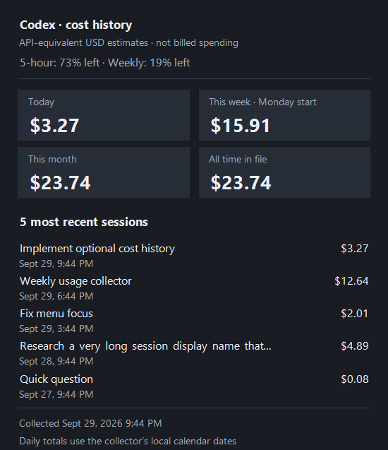

# Codex Meter

**Your Codex limits, beside the Windows clock.**

A minimal native Windows 11 tray app. The icon shows your lowest percentage remaining; click it for all reported limits and reset times. Refreshes every **15 minutes**, with **no model calls or token consumption for polling**.

[**Download for Windows**](https://github.com/Bangerz/CodexMeter/releases/latest) · [CC0 license](LICENSE)


*Illustrative sample data, not a live account.*

## Install

1. Download the Windows x64 ZIP from [Releases](https://github.com/Bangerz/CodexMeter/releases/latest).
2. Install the **[.NET 10 Desktop Runtime, Windows x64](https://dotnet.microsoft.com/en-us/download/dotnet/10.0)** if needed. Choose Desktop Runtime, not just the base .NET Runtime.
3. Extract the ZIP to a permanent folder and run `CodexMeter.exe`.
4. Have the **Codex desktop app or native Codex CLI** installed and signed in with your ChatGPT account.

The small **framework-dependent** download does not bundle .NET. No administrator privileges, installer, service, or browser is required. The executable is unsigned; Windows may show an unrecognized-app warning.

Windows may initially put the icon under the tray's **^** overflow. Drag it beside the clock to keep it visible.

## Use

- **Tray number:** lowest percentage remaining across reported windows.
- **Left-click:** all percentages, reset countdowns, local reset dates, and the last successful update time.
- **Weekly progress bar:** upper lane shows quota remaining; the gold lower lane shows the percentage of the week remaining until reset. Both lanes and their text labels stay visible regardless of which is higher. Time is calculated from the reported reset and window duration, and updates every minute while the panel is open.
- **Right-click:** Show limits, Refresh now, Show cost history, Choose cost-history file, Start with Windows, or Quit.
- **Refresh:** at launch, every 15 minutes, and after resuming Windows when an update is due.
- **Amber `!`:** a check failed or data is stale. Retained figures are marked as last known.
- **Start with Windows:** optional, off by default. Enable after choosing a permanent folder; disable before moving or deleting the app.

Supports weekly-only accounts, five-hour plus weekly windows, and multiple usage buckets. Missing values stay unavailable. Passing a reset time does not manufacture replenished quota.


## No tokens used for polling

Each poll starts a hidden `codex app-server --listen stdio://`, sends only:

1. `initialize`
2. `initialized`
3. `account/rateLimits/read`

Then it closes its private helper. No thread or model turn is started. It never redeems resets, purchases credits, or calls an inference API.

Codex manages its existing authentication and any required token refresh. Codex Meter does not itself read or save OAuth credentials or raw server logs. When the optional cost integration is enabled, it reads only a compact local Codex cost export. Startup is stored in the current user's Windows Run registry key; cost preferences are stored under `HKCU\Software\CodexMeter`.

## Optional cost history on hover

Cost history is **off by default** and requires no Node.js or ccusage dependency in the app. Right-click the tray icon and enable **Show cost history**. It reads `D:\Tools\UsageCollector\data\codex-hover.json` by default; **Choose cost-history file…** selects a different export.

Hover shows today, the current Monday-start week, current month, all retained daily costs, and the five sessions with most recent recorded activity, including their display names and costs. Costs are **API-equivalent USD estimates, not subscription charges or billed spending**. Collection time is visible; exports older than seven days are marked stale. Missing pricing is flagged. A missing or invalid export affects only cost history; quota polling continues normally.

The app reads a small `schemaVersion: 1`, `provider: "codex"` export. It never runs a collector itself. Cursor Agent, Copilot and Antigravity records are excluded from this export.



*Illustrative cost data, not a live account.*

## Weekly local usage collector

The independent scripts in [`scripts/`](scripts/) collect and retain local report history. Copy `usage-collector.mjs`, `Run-UsageCollector.ps1`, and `Install-UsageCollectorTask.ps1` to a permanent directory, copy `collector-config.example.json` as `collector-config.json`, and edit its executable/data paths. Requires **Node.js 24+** and **pnpm**. No tokens or model calls are needed.

The collector uses pinned `ccusage@20.0.26` to run the requested reports:

```powershell
pnpm dlx ccusage@20.0.26 --json
pnpm dlx ccusage@20.0.26 session --json
```

Validated output replaces the configured latest report files (by default `D:\usage-report-all.json` and `D:\usage-report-session.json`) as UTF-8. Existing UTF-16 PowerShell exports can be imported. An additional `daily --by-agent --json` report supplies Codex-only period totals. Current [ccusage](https://ccusage.com/guide/getting-started) also supports [Copilot CLI](https://ccusage.com/guide/copilot/) and [Antigravity](https://ccusage.com/guide/antigravity/) when compatible local token records are available. Copilot IDE-only history and Antigravity files without token metrics cannot produce usage totals.

Only configured source directories are discovered. Other agents are redirected to empty directories; package caches and temporary files stay inside the collector's data directory. The example enables Copilot CLI and Antigravity roots; remove their entries to disable them. The collector does not sign into accounts, read credential files, or enable telemetry/hooks.

```powershell
# Import existing reports without fetching or changing the weekly guard.
.\Run-UsageCollector.ps1 -MergeOnly
# Collect now if at least seven days have passed since the last attempt.
.\Run-UsageCollector.ps1
# Register an interactive, limited-privilege task for the current user.
.\Install-UsageCollectorTask.ps1
```

The Windows task triggers **two minutes after this user's logon**. Its persistent guard allows at most one collection attempt every seven days, including failed attempts and manual invocations. It does not collect while logged out. A lock plus Task Scheduler's `IgnoreNew` setting prevents overlapping runs. `collector-state.json`, `source-status.json` and `collector-last-run.log` show outcomes and the next attempt can run after the seven-day guard expires.

Files inside the configured data directory:

| File | Content |
| --- | --- |
| `usage-all.aggregate.json` | Retained unified daily snapshots and recalculated totals |
| `usage-session.aggregate.json` | Retained sessions, including Codex display names |
| `usage-agents.aggregate.json` | Retained daily snapshots separated by agent |
| `codex-hover.json` | Compact Codex-only export for CodexMeter |
| `usage-cursor-agent.aggregate.json` | Optional approximate Cursor Agent calls and sessions |
| `usage-antigravity-native.aggregate.json` | Optional native Antigravity token records from its local server or saved cache |

Daily rows deduplicate by agent and date. Sessions deduplicate by agent and stable ID; Codex rollout paths normalize to the thread UUID so moving a file to an archive does not duplicate it. A newer snapshot **replaces** an existing total; repeated exports are never added together. Records absent from a later report are retained. Daily and session totals overlap and must not be added to each other. These summary reports cannot reconstruct deleted portions of a changing daily snapshot; retained sessions and dates provide the available history. Preserve the local source logs when complete event-level history is required.

Codex display names come from `session_index.jsonl`, with current desktop `threads.name` values preferred when available. Subagents use their recorded nickname. The collector reads only IDs/names from the desktop database, not conversation bodies. Missing names retain a previously saved name or use a short session-ID fallback.

### Cursor Agent estimates

[CodeBurn's Cursor Agent provider](https://github.com/getagentseal/codeburn) covers Agent transcripts separately from its IDE provider. It estimates tokens from transcript characters divided by four and can use fallback model pricing; its costs are explicitly marked approximate. It cannot recover exact historical token usage. Stable conversation/turn keys deduplicate the collected calls, including a last turn that grows between runs. The provider attributes turns to conversation activity/file timestamps, so historical daily placement is approximate too.

For bounded local collection, the included installer downloads the pinned npm `codeburn@0.9.25` tarball, checks its fixed SHA-512 integrity, extracts it, and reconstructs the passive provider:

```powershell
.\Install-CodeBurnProvider.ps1
```

`Prepare-CodeBurn.mjs` extracts eleven source files from the exact published sourcemap and strips TypeScript types without changing their logic. The installer also verifies and extracts two pinned ANSI helper dependencies. No CLI configuration, live pricing initialization, or other-provider discovery is invoked. Set `cursorAgent.enabled` to `true` and configure the `.cursor` root and reconstructed module directory. This pinned internal interface is optional and must be rechecked before upgrading CodeBurn. Keep its package license and provenance alongside the vendor files; do not commit personal reports or transcripts.

### Native Antigravity fallback

If ccusage finds no compatible Antigravity token records, `antigravityNative.enabled` can use CodeBurn's native provider. It discovers only the configured `conversationDirectories`, queries a **running local Antigravity language server** for recorded token metadata, and retains the provider's cache on D:. It sends no model request. Native `.pb` files cannot supply token metrics offline; uncached sessions need Antigravity open during an eligible collection. The source status reports this condition instead of presenting a zero cost as verified usage.

Its calculated costs may undercount cache/output fields that Antigravity does not report. Native records deduplicate by response ID in a separate aggregate. They are collected only when the current ccusage report has no Antigravity sessions, and are not added to ccusage totals or shown in CodexMeter.

See the [official Codex App Server protocol](https://learn.chatgpt.com/docs/app-server#6-rate-limits-chatgpt). The app-server command is experimental; future Codex changes may require an update.

## Troubleshooting

**No usage:** Open Codex, confirm ChatGPT sign-in, then click Refresh. API-key-only accounts do not supply ChatGPT plan limits.

**Executable not found:** The app checks the running Codex process, the desktop app's versioned binary directory, and native CLI installations on PATH. Set `CODEX_METER_CODEX_PATH` to the full path of your `codex.exe` to override discovery.

**Different account:** The helper inherits `CODEX_HOME` if set. Limits belong to the signed-in account, not a single task.

**Uninstall:** Disable Start with Windows, choose Quit, and delete its folder.

## Build

Requires Windows and the .NET 10 SDK. No third-party library packages are used.

```powershell
.\build.ps1
dotnet run --project .\tests\CodexMeter.Tests.csproj -c Release
```

The executable is written to `artifacts/publish/CodexMeter.exe`. Build caches and temporary files stay in the repository.

Build, check, and package a release:

```powershell
.\release.ps1
```

Produces a Windows x64 ZIP and SHA-256 checksums under `artifacts/releases/`. Focused checks cover parsing, missing values, multiple buckets, the exact read-only request sequence, sign-in failures, and helper cancellation.

Diagnostics:

- `CodexMeter.exe --check <output.json>` performs one real usage check and writes normalized quota data. Keep that output private.
- `CodexMeter.exe --preview <directory>` renders synthetic UI samples and small-icon comparisons.

## License and acknowledgments

**[CC0 1.0 Universal](LICENSE).**

Inspired by [CodexReserve](https://github.com/yourarnav/CodexReserve). This is an independent Windows implementation; no code or artwork was copied from that project.

Unofficial and not affiliated with OpenAI. No notifications, sounds, automatic updates, or app-owned analytics.
